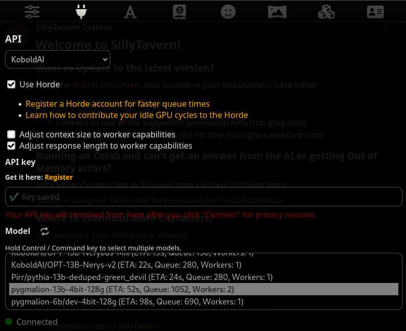
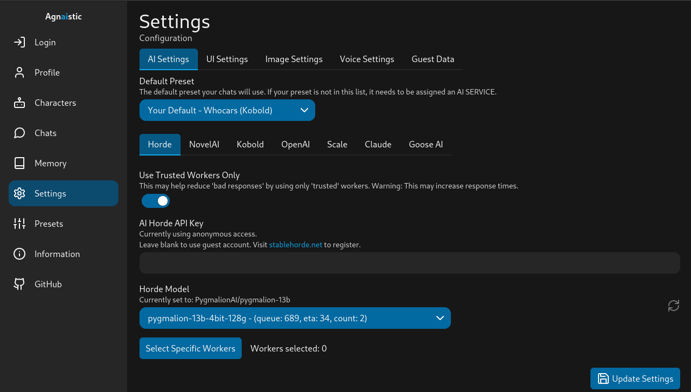
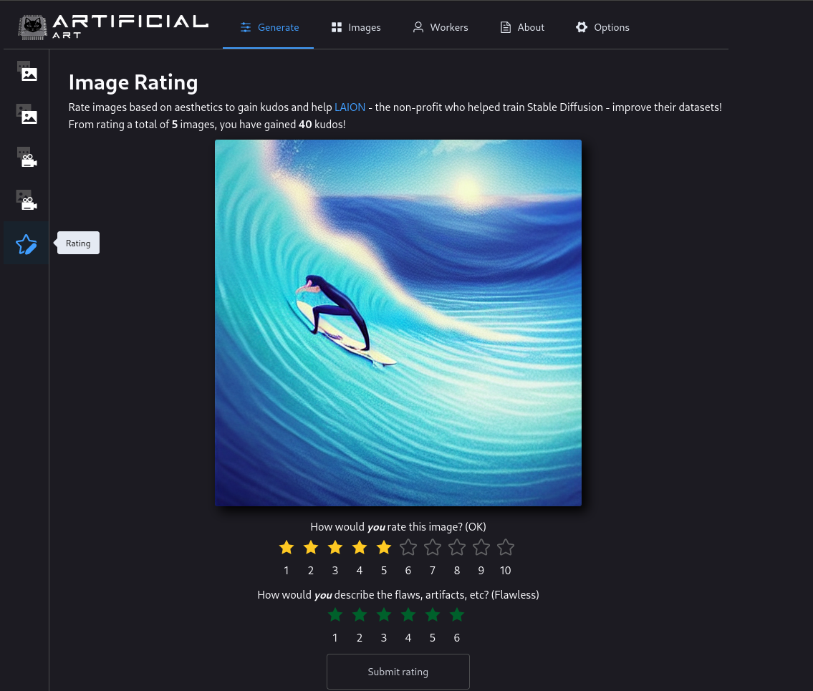
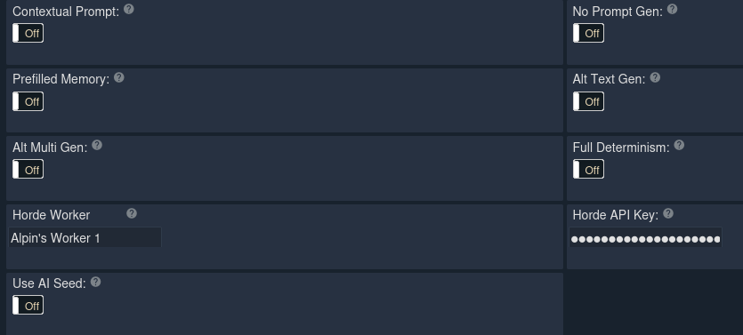
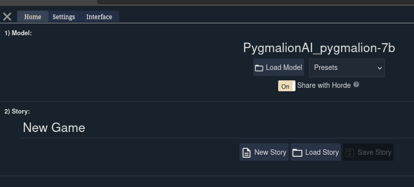

Kobold Horde is a massive crowdsourced distributed inference cluster for AI models. It allows users running the model locally to host it for other users via the AI Horde website. 

In this section, you'll learn how to both *host* Pygmalion on Kobold Horde or use one of the hosted instances of Pygmalion for free.

You can use the horde anonymously, but without kudos, you'll be placed at the bottom of the queue so it might take too long for a response. You can login to the horde to receive/spend kudos by acquiring an [API Key](https://horde.koboldai.net/register).
!!!warning Keep your API key a secret!
This key will be permanently yours. It's as important as a password, so never give it to anyone if they ask for it. For transferring kudos, only your username is required (e.g. `alpin#13095`).
!!! 

## How to use Pygmalion on the Horde

Pygmalion is a popular model, so you'll always find at least a few workers (people hosting the model for the public) on the Horde. You can either use the official [Kobold Horde website](https://lite.koboldai.net), but it's recommended to use a UI such as [SillyTavern](https://docs.alpindale.dev/pygmalion-extras/sillytavern/) or [Agnaistic](https://docs.alpindale.dev/pygmalion-extras/agnaistic/). 

### SillyTavern

Follow the installation instructions [here](https://docs.alpindale.dev/pygmalion-extras/sillytavern/). Once you launch SillyTavern, click on the **red plug** icon, choose **KoboldAI** from the "API" drop-down menu, check the "**Use Horde**" option, paste your Horde API Key in the "**API Key**" input box, and then select your desired model from the models list. 

You're done! You can now start chatting. Import a character by opening "Character Management", clicking on the "Import Character from File" button, and selecting your character. Character cards can be acquired from the [Discord](https://discord.com/invite/pygmalionai) or the unofficial [booru](https://booru.plus/+pygmalion).

### Agnaistic

You can install Agnaistic on your PC, but it's recommended to use their website, which works on mobile phones as well.

Navigate to the Agnaistic website here:

[!button Agnaistic Website](https://agnai.chat){target="_blank"}

Once you're in, it's recommended to login so your chats and logs are saved. To access the horde, head over to Settings, use the "Horde" preset, and enter your API key. Select Pygmalion from the "Horde Model" drop-down list. Then Update Settings to save your configuration. You can now start chatting!

## How to acquire kudos

You can earn kudos by either hosting a model on the horde yourself - which will net you the highest amount of kudos - or rate images for the Stable Horde to earn an average of 8 kudos per rating. Each rating can take up to 3 to 5 seconds. To start rating images, head over to the [Artifical Art](https://artificial-art.eu) website, enter your API Key in the "Options" menu, and in the "Generate" menu, select the "Rating" section. 

Alternatively, you can ask other users to transfer kudos for you. 

## How to host Pygmalion on the Horde

You'll need to run Pygmalion with [KoboldAI](https://docs.alpindale.dev/local-installation-(gpu)/kobold/). The [4bit KoboldAI](https://docs.alpindale.dev/local-installation-(gpu)/koboldai4bit/) will also work fine. Make sure you're in the New UI (you can access it by adding `/new_ui` at the end of your Kobold URL or clicking on the `Try New UI` button). Load the model you want to host, head over to "Settings" and set your Horde Worker's name (arbitrary name) and the Horde API Key (this will be the API key you get when registering). 

Then head over to home, and toggle the "Share with Horde" switch. 

Have fun hosting!