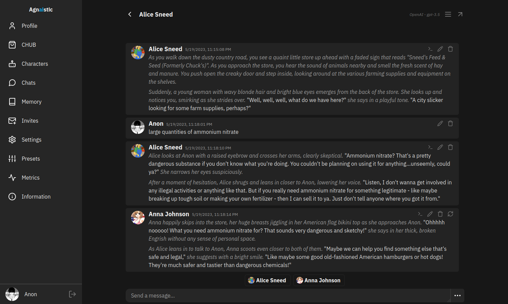
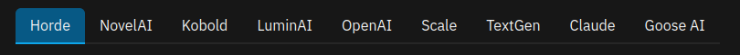
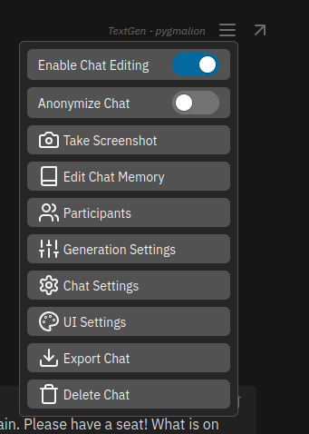
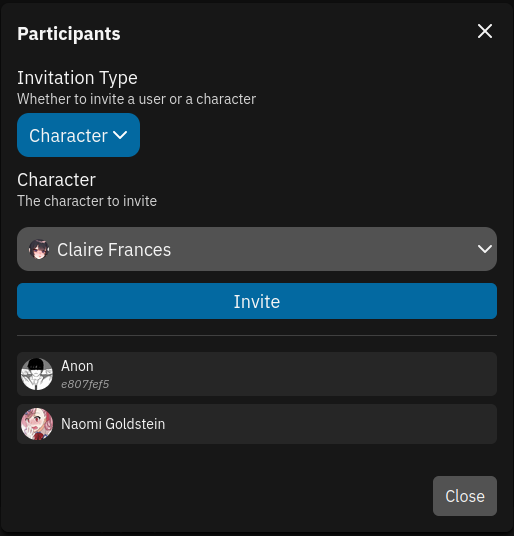
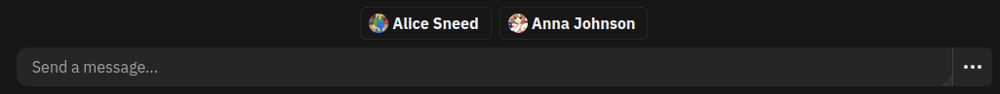
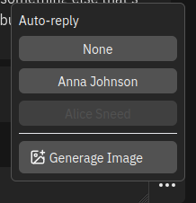

Agnaistic is a user interface you can install on your computer (or use the [production version](https://agnai.chat)) that allows you to interact with text generation AIs and chat/roleplay with the characters you or the community create. Agnaistic is forked from the official Pygmalion website UI, [Galatea UI](https://github.com/PygmalionAI/galatea-ui).

!!!info
Agnaistic is just a UI; you will need to connect it to a backend: [KoboldAI](https://docs.alpindale.dev/local-installation-(gpu)/kobold/) or [TextGen WebUI](https://docs.alpindale.dev/local-installation-(gpu)/oobabooga/).
!!!



- [Usage](https://docs.alpindale.dev/pygmalion-extras/agnaistic/#usage)
- [Installation](https://docs.alpindale.dev/pygmalion-extras/agnaistic/#installation)

# Usage

### Navigation


On the left side of your screen (or upon clicking the burger menu if on mobile/low resolution device) you will find the different tabs for navigating Agnaistic.
- Profile
  - Where you set your profile picture, display name, and find your user ID.
- CHUB
  - Where you can preview/download characters and lorebooks (called "Memory Books" by Agnaistic.)
- Characters
  - List of all characters you have downloaded. You can favorite, download, edit, duplicate, and delete characters here.
- Chats
  - Self explanatory
- Memory
  - List of all memory books you have downloaded. You can edit, download, and delete them here.
- Invites
  - If another Agnaistic user has invited you to a [group chat](https://docs.alpindale.dev/pygmalion-extras/agnaistic/#group-chat) this is where the invite will appear.
- Settings
  - Where you can change various settings about adapters, how the UI looks, how images are generated, and various settings about STT/TTS.
- Presets
  - Where all your presets are stored, default presets are listed here and cannot be deleted.
- Metrics
  - Only visible to admins, show various stats like how many users are online, how many users are registered, and allows you to change a users password.
- Information
  - Important things like the [Memory Book Guide](https://github.com/luminai-companion/agn-ai/blob/dev/instructions/memory.md), [Feature Roadmap](https://github.com/users/sceuick/projects/1/views/1), and more

### Adapters/Services



Adapters/Services are synonymous with the term "backend" in these pygmalion docs, Agnaistic supports 
- Horde
- Novel AI
- [KoboldAI](https://docs.alpindale.dev/local-installation-(gpu)/kobold/)
- OpenAI, 
- Scale
- [TextGen WebUI](https://docs.alpindale.dev/local-installation-(gpu)/oobabooga/)
- Claude
- Goose ai

### Presets

Presets are a groups of settings used to prompt the backend. Each preset needs a service. Depending on what service you pick for the preset you will see different settings.

### Group Chats

1. Click burger menu in top right of chat window

2. Click Participants
3. If inviting user paste in User ID if inviting user (yes you have to ask them for their User ID)
4. If adding another character change invitation type to character and select character from dropdown
5. Click invite


For multi-character chats you will have to click on which character you want to respond with the bottom bar.



If you click the context menu you can turn on auto reply for a character. Only one character can be set to auto reply.



# Installation
Self hosting Agnaistic is simple. You have a couple of options:
- [NPM](https://docs.alpindale.dev/pygmalion-extras/agnaistic/#npm-installation)
- [Docker](https://docs.alpindale.dev/pygmalion-extras/agnaistic/#docker-installation)
- [Manually](https://docs.alpindale.dev/pygmalion-extras/agnaistic/#manual-installation)

### NPM Installation

(Requires [Node.js](https://nodejs.org/en/download/))  
Agnaistic is bundled as an NPM package and can be installed globally:

```sh
# Install or update:
> npm install agnai -g
> agnai

# View launch options:
> agnai help
```

### Docker Installation

1. Clone the project
   - `git clone -b dev https://github.com/luminai-companion/agn-ai && cd agn-ai`
2. With MongoDB: 
   - `docker compose -p agnai -f self-host.docker-compose.yml up -d`
3. Without MongoDB: `docker run -dt --restart=always -p 3001:3001 ghcr.io/luminai-companion/agnaistic:latest`
    - `-dt` Run the container detached
    - `--restart=always` Restart at start up or if the server crashes
    - `-p 3001:3001` Expose port 3001. Access the app at `http://localhost:3001`

### Manual Installation

1. Install [Node.js](https://nodejs.org/en/download/)
2. Install [MongoDB](https://www.mongodb.com/docs/manual/installation/) **Optional**
    - The database is optional. Agnaistic will run in `anonymous-only` mode if there is no database available.
    - `Anonymous` users have their data saved to the browser's local storage. Your data will "persist", but not be shareable between devices or other browsers. Clearing your browser's application data/cookies will delete this data.
3. Download the project: `git clone https://github.com/luminai-companion/agn-ai` or [download it](https://github.com/luminai-companion/agn-ai/archive/refs/heads/dev.zip)
4. From inside the cloned/unpacked folder in your terminal/console:
    - `npm run deps`
        - **Do this every time you update AgnAI, just in case.**
        - This will install the dependencies using `pnpm v6`
    - `npm run build:all`
    - Build and run the project in watch mode:
        - Mac/Linux: `npm run start`
        - Windows: `npm run start:win`
    - Build and run the project with Local Tunnel:
        - Mac/Linux: `npm run start:public`
        - Windows: `npm run start:public:win`
