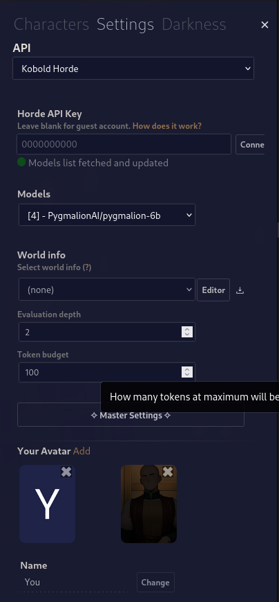
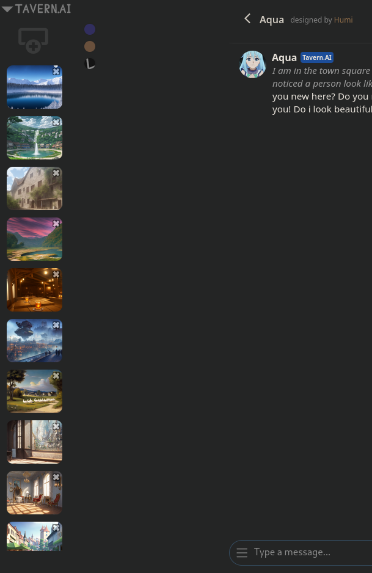

[TavernAI](https://github.com/TavernAI/TavernAI) is chat front-end written in JavaScript for providing an atmospheric user interface to various LLM APIs. Projects such as [SillyTavern](https://github.com/Cohee1207/SillyTavern) have been [forked](https://docs.github.com/en/pull-requests/collaborating-with-pull-requests/working-with-forks/about-forks) from TavernAI.

## Navigation

#### Settings Menu

This is the first thing you want to configure when opening TavernAI. Here, you can select which API to use, the model, the generation settings, and your own username.

The currently supported APIs are [KoboldAI](https://docs.pygmalion.chat/local-installation-(gpu)/kobold/), [Kobold Horde](https://docs.pygmalion.chat/cloud-installation/horde/), [NovelAI](https://novelai.net/), and [OpenAI](https://platform.openai.com/). Pygmalion is only available through KoboldAI and Kobold Horde, so please refer to their respective pages on how to set them up for using with Pygmalion.

#### Character Menu

This is where you can select your character, create a new one, upload a pre-made character, or edit your characters. The `+New Character` button will open the Character Creator tool, the `+Import` button will let you import a PNG, WEBP or JSON character file, and the `+New Folder` option will allow you to group characters together for easier navigation. Clicking on a character will take you to the Character's page, where you can edit their definition and example chats.

#### Backgrounds and Themes

You can select a background image (or add a custom one) and select the TavernAI theme here. The three circles next to the BG selector are the themes. Keep in mind that background images are unavailable for the Character.AI theme. This menu is initially hidden, you'll have to click on the "TavernAI" text to expand it.

***
## Installation

TavernAI